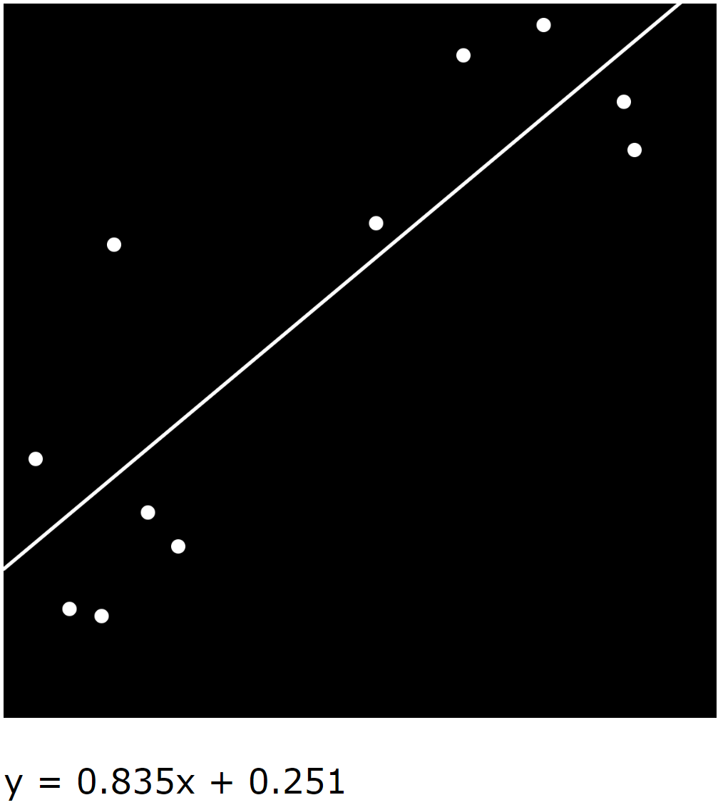

## Linear Regression with TensorFlow.js

Technologies used:
- [TensorFlow.js](https://www.tensorflow.org/js)
- [p5.js](https://p5js.org/)
- HTML/CSS, JavaScript 

## Demo

The dots are the user's mouse press events.

Credits:
- I was able to build this from following [Daniel Shiffman](https://shiffman.net/)'s [Coding Challenge #104: Linear Regression with TensorFlow.js](https://youtu.be/dLp10CFIvxI) tutorial.
