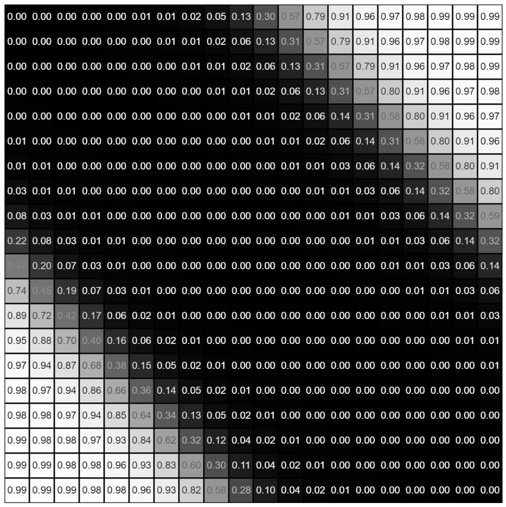

## XOR with TensorFlow.js

Technologies used:
- [TensorFlow.js](https://www.tensorflow.org/js)
- [p5.js](https://p5js.org/)
- HTML/CSS, JavaScript 

## Demo

Notice: 
- In this solution: 0 is True, and 1 is False.
- The value of (0,0) and (1,1), representing (True, True) and (False, False), get mapped to 1 (False). While the value of (0,1) and (1,0), representing (True, False) and (False, True), get mapped to 0 (True). Thus, we can conclude that this accurately models XOR.

Credits:
- I was able to build this from following [Daniel Shiffman](https://shiffman.net/)'s [Coding Challenge #106: XOR Problem with TensorFlow.js](https://youtu.be/N3ZnNa01BPM) tutorial.
